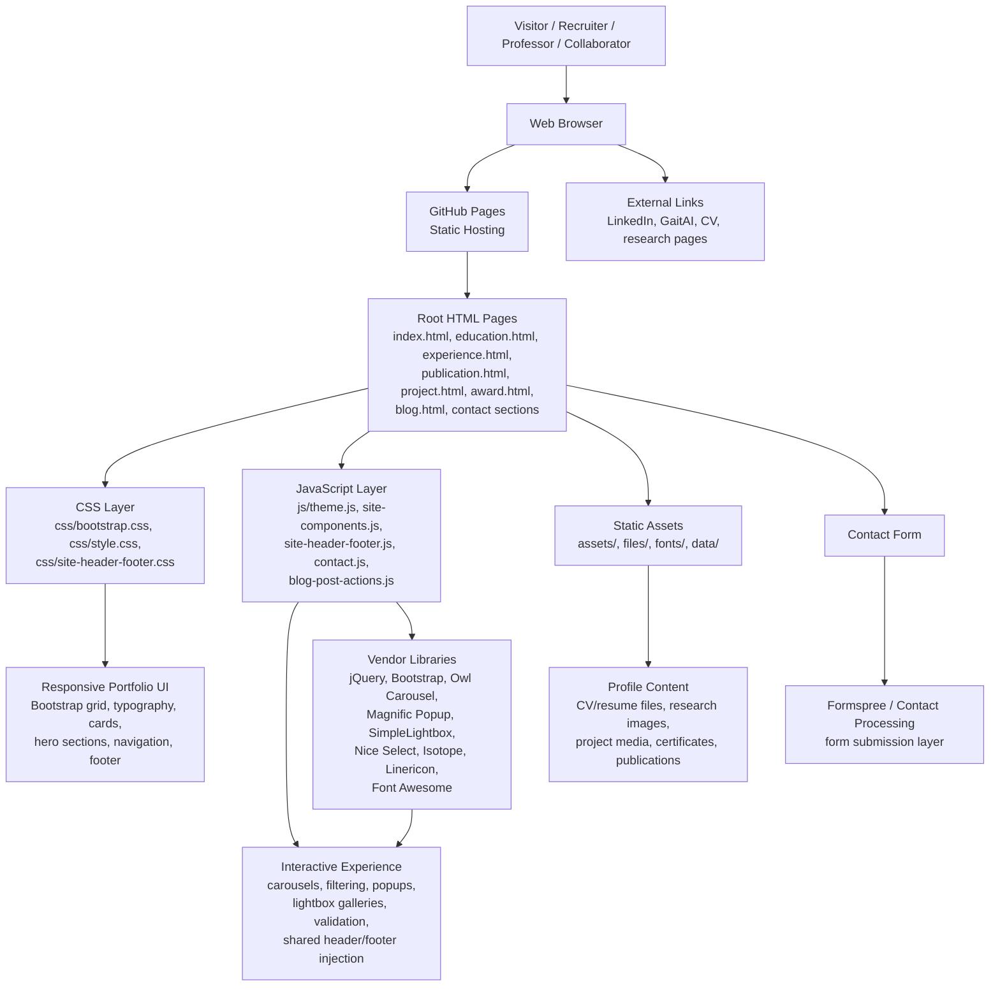
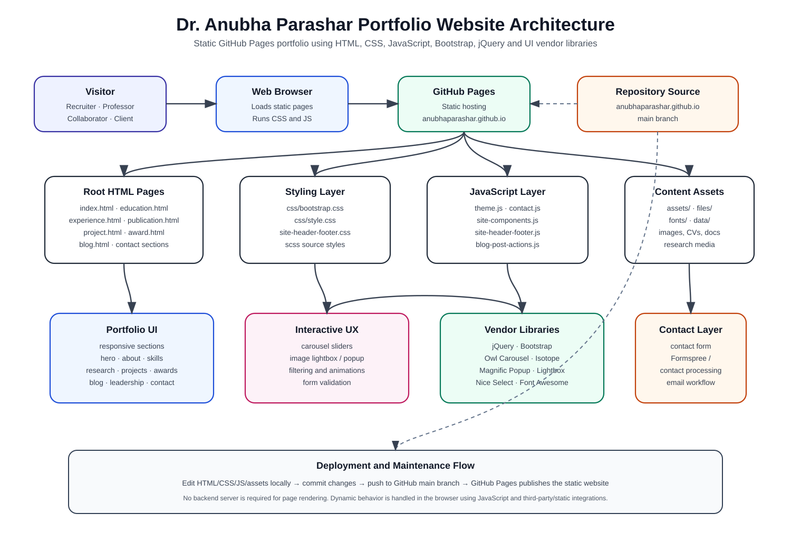

# Dr. Anubha Parashar Portfolio Website

[](https://anubhaparashar.github.io/)
[](https://github.com/anubhaparashar/anubhaparashar.github.io)
[](https://anubhaparashar.github.io/)

## Overview

This repository contains the source code for the personal academic, research, and professional portfolio website of **Dr. Anubha Parashar**. The website presents her profile as an **Analytics & AI Engineer, AI Research Scientist, Computer Vision Expert, Deep Learning Researcher, Educator, and Founder of GaitAI**.

The website is designed as a static, responsive portfolio hosted on **GitHub Pages**. It showcases professional experience, education, research areas, publications, patents, projects, awards, leadership activities, blog posts, and contact information.

## Live Website

**Website:** [https://anubhaparashar.github.io/](https://anubhaparashar.github.io/)  
**Repository:** [https://github.com/anubhaparashar/anubhaparashar.github.io](https://github.com/anubhaparashar/anubhaparashar.github.io)

## Key Features

- Professional landing page with research and industry profile
- Responsive portfolio layout for desktop, tablet, and mobile
- Dedicated pages for education, experience, publications, projects, awards, conferences, leadership, sports, and blog content
- Research-focused sections covering AI, computer vision, deep learning, gait recognition, biometrics, NLP, IoT, robotics, and data science
- Project and publication showcase
- Downloadable CV and resume links
- Interactive UI components such as sliders, popups, filters, lightbox galleries, and smooth navigation
- Contact form integration using Formspree/contact processing
- Static hosting through GitHub Pages

## Technology Stack

| Layer | Technologies |
|---|---|
| Structure | HTML |
| Styling | CSS, SCSS, Bootstrap |
| Interactivity | JavaScript, jQuery |
| Icons | Font Awesome, Linericon |
| UI Components | Owl Carousel, Magnific Popup, Nice Select, SimpleLightbox, Isotope |
| Contact | Formspree / Contact form processing |
| Hosting | GitHub Pages |
| Assets | Images, fonts, documents, CV, resume, research media |

## Website Architecture

The website follows a **static front-end architecture**. GitHub Pages serves the HTML, CSS, JavaScript, images, documents, and vendor libraries directly to the browser. All page rendering happens client-side. Interactive behavior is handled using JavaScript and jQuery-based plugins.



A separate SVG version of this architecture is available here:

```text
docs/website-architecture.svg
```

## High-Level Architecture Diagram



## Repository Structure

```text
anubhaparashar.github.io/
├── index.html                         # Main landing page
├── education.html                     # Education profile
├── experience.html                    # Professional experience
├── publication.html                   # Publications and journals
├── project.html                       # Project portfolio
├── award.html                         # Awards and recognitions
├── conferences.html                   # Conferences and academic activities
├── grant.html                         # Grants and funded work
├── industry.html                      # Industry projects and contributions
├── leadership-activities.html         # Leadership, activities, and responsibilities
├── academics.html                     # Academic profile
├── avocations.html                    # Hobbies and personal interests
├── blog.html                          # Blog listing page
├── connection.html                    # Connections and networking page
├── sports.html                        # Sports and extracurricular activities
├── contact_process.php                # Contact processing file, if server-side processing is enabled
│
├── assets/                            # Website images and visual assets
├── css/                               # Main stylesheets and Bootstrap CSS
├── scss/                              # SCSS source files
├── js/                                # JavaScript files and site behavior
├── vendors/                           # Third-party UI plugins and libraries
├── fonts/                             # Font assets and icon fonts
├── files/                             # CV, resume, documents, and downloadable files
├── data/                              # Static data files
├── forms/                             # Contact or form-related assets
├── docs/                              # Documentation and architecture diagrams
├── .nojekyll                          # Disables Jekyll processing for GitHub Pages
└── README.md                          # Project documentation
```

## Main Pages

| Page | Purpose |
|---|---|
| `index.html` | Main homepage and personal brand introduction |
| `education.html` | Academic background and qualifications |
| `experience.html` | Teaching, research, and industry experience |
| `publication.html` | Journal and research publication record |
| `project.html` | AI, computer vision, analytics, and engineering projects |
| `award.html` | Awards, recognitions, and achievements |
| `conferences.html` | Conference participation and academic engagement |
| `leadership-activities.html` | Leadership roles and responsibilities |
| `blog.html` | Blog and article listing |
| `connection.html` | Networking and professional connection section |
| `avocations.html` | Personal interests and activities |
| `sports.html` | Sports-related achievements and activities |

## Front-End Modules

### HTML Pages

The website uses multiple standalone HTML pages. Each page represents a major section of the portfolio and links to shared CSS, JavaScript, fonts, images, and vendor libraries.

### CSS and SCSS

The styling layer includes Bootstrap for responsive layout, custom CSS for visual design, and SCSS files for maintainable style development.

### JavaScript

The JavaScript layer handles navigation behavior, page interactions, UI effects, contact form behavior, reusable site components, and blog-related actions.

### Vendor Libraries

The website uses third-party front-end libraries to improve visual presentation and interactivity:

- **Bootstrap** for responsive layout and UI structure
- **jQuery** for DOM manipulation and plugin support
- **Font Awesome** and **Linericon** for icons
- **Owl Carousel** for sliders and carousels
- **Magnific Popup** and **SimpleLightbox** for image/gallery popups
- **Nice Select** for styled select controls
- **Isotope** for filtering and grid layouts

## Deployment

The website is deployed using **GitHub Pages** from the repository's main branch.

### Typical Deployment Flow

```bash
git add .
git commit -m "Update portfolio website"
git push origin main
```

After pushing to the configured GitHub Pages branch, GitHub Pages publishes the static site automatically.

## Local Development

Because this is a static website, it can be opened directly in a browser. For a cleaner local preview, run a simple local server from the repository root:

```bash
python -m http.server 8000
```

Then open:

```text
http://localhost:8000
```

## Customization Guide

### Update Personal Information

Edit the relevant HTML page, usually:

```text
index.html
education.html
experience.html
publication.html
project.html
```

### Update Styling

Modify:

```text
css/style.css
css/site-header-footer.css
scss/
```

### Update Scripts

Modify:

```text
js/theme.js
js/site-components.js
js/site-header-footer.js
js/contact.js
js/blog-post-actions.js
```

### Update Images and Documents

Add or replace files inside:

```text
assets/
files/
data/
```

## Suggested Future Enhancements

- Add analytics dashboard for page views, likes, comments, and blog engagement
- Connect blog interactions to Firebase or another backend
- Add structured data using JSON-LD for better search visibility
- Optimize large images for faster loading
- Add sitemap and robots.txt
- Add GitHub Actions workflow for link checking and asset validation
- Add accessibility improvements such as alt text audits and keyboard navigation checks
- Add publication filters by journal, year, topic, and indexing category

## Author

**Dr. Anubha Parashar**  
Analytics & AI Engineer · AI Research Scientist · Computer Vision Expert · Deep Learning Researcher · Educator · Founder, GaitAI

## License

This repository is maintained as a personal portfolio website. Reuse of design, text, images, CV, documents, or personal academic content should be done only with permission from the author.
