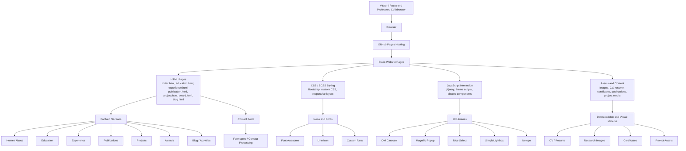

# Dr. Anubha Parashar — Personal Portfolio Website

[](https://anubhaparashar.github.io/)
[](https://github.com/anubhaparashar/anubhaparashar.github.io)
[](https://anubhaparashar.github.io/)

## Overview

This repository contains the source code for the personal academic, research, and professional portfolio website of **Dr. Anubha Parashar**.

The website is designed as a static, responsive portfolio hosted using **GitHub Pages**. It presents education, professional experience, research publications, projects, awards, leadership activities, blogs, and contact information.

The portfolio highlights work in **Artificial Intelligence, Machine Learning, Deep Learning, Computer Vision, Gait Recognition, Biometrics, Generative AI, Agentic AI, MLOps, DevSecOps, and Data Science**.

---

## Live Links

| Resource | Link |
|---|---|
| Live Website | <https://anubhaparashar.github.io/> |
| GitHub Repository | <https://github.com/anubhaparashar/anubhaparashar.github.io> |

---

## Technologies Used Here

This website is built using the following front-end technologies, libraries, plugins, and hosting services:

| Technology | Purpose in Website |
|---|---|
| **HTML** | Defines the structure of all portfolio pages such as home, education, experience, publications, projects, awards, blog, and contact sections |
| **CSS** | Provides custom styling, layout refinement, spacing, typography, and visual presentation |
| **JavaScript** | Adds interactive behavior, dynamic components, form behavior, filtering, animation support, and client-side logic |
| **Bootstrap** | Provides responsive grid system, layout utilities, buttons, navigation, and mobile-friendly page design |
| **jQuery** | Supports DOM manipulation and works with several UI plugins used in the website |
| **Font Awesome** | Provides scalable icons used across the website UI |
| **Linericon** | Provides additional icon support for sections, cards, and interface elements |
| **Owl Carousel** | Enables carousel and slider-based content presentation |
| **Magnific Popup** | Provides popup and modal-style image/content display |
| **Nice Select** | Enhances select/dropdown styling and user interface consistency |
| **SimpleLightbox** | Enables image lightbox/gallery viewing |
| **Isotope** | Supports filtering and grid layout behavior for portfolio/project-style sections |
| **Formspree** | Handles contact form submissions without requiring a custom backend server |
| **GitHub Pages** | Hosts and publishes the static website online |

---

## Detected Repository Language Stack

GitHub detects the repository mainly as a static front-end website, with the largest portions written in:

| Language | Usage |
|---|---|
| **HTML** | Main page structure |
| **JavaScript** | Interactivity and UI behavior |
| **CSS** | Styling |
| **SCSS** | Source styling files |
| **Python** | Utility/helper scripts |
| **PowerShell** | Asset or file management scripts |
| **PHP** | Contact processing file |

---

## Key Website Features

- Responsive personal portfolio website
- Professional academic and industry profile
- Research publication showcase
- AI/ML and computer vision project portfolio
- Awards and achievements section
- Education and experience timeline
- Leadership, activities, sports, and avocations sections
- Blog and connection pages
- Downloadable CV/resume and related files
- Image galleries and interactive UI elements
- Contact form integration
- Static deployment using GitHub Pages

---

## Website Pages

| Page | Description |
|---|---|
| `index.html` | Main homepage and professional introduction |
| `education.html` | Education profile and academic background |
| `experience.html` | Professional, academic, and industry experience |
| `publication.html` | Research publications and journal papers |
| `project.html` | Projects in AI, computer vision, analytics, and engineering |
| `award.html` | Awards, honors, and recognitions |
| `conferences.html` | Conferences and academic participation |
| `grant.html` | Grant and funded-work related page |
| `industry.html` | Industry-oriented work and applied AI projects |
| `academics.html` | Academic profile and teaching/research content |
| `leadership-activities.html` | Leadership positions and activities |
| `avocations.html` | Personal interests and hobbies |
| `blog.html` | Blog listing and article-style content |
| `connection.html` | Professional connections and network-oriented content |
| `sports.html` | Sports and extracurricular activities |

---

## Folder Structure

```text
anubhaparashar.github.io/
├── index.html
├── education.html
├── experience.html
├── publication.html
├── project.html
├── award.html
├── conferences.html
├── grant.html
├── industry.html
├── academics.html
├── leadership-activities.html
├── avocations.html
├── blog.html
├── connection.html
├── sports.html
├── contact_process.php
│
├── assets/              # Images and visual assets
├── css/                 # CSS files including Bootstrap and custom styles
├── scss/                # SCSS source files
├── js/                  # JavaScript files and website behavior
├── vendors/             # Third-party libraries and plugins
├── fonts/               # Font and icon font assets
├── files/               # CV, resume, documents, and downloadable files
├── data/                # Static data files
├── forms/               # Contact/form-related files
├── docs/                # Documentation and architecture diagrams
├── .nojekyll            # Prevents GitHub Pages from applying Jekyll processing
└── README.md
```

---

## Website Architecture

The website uses a **static front-end architecture**. GitHub Pages serves the HTML, CSS, JavaScript, images, fonts, and documents directly to the browser. No custom backend server is required for rendering the website.



A separate architecture diagram is also included:

```text
docs/website-architecture.svg
docs/website-architecture.mmd
```

---

## Architecture Diagram


---

## How the Website Works

1. The user opens the website URL in a browser.
2. GitHub Pages serves the static HTML page.
3. The HTML page loads CSS, JavaScript, fonts, images, and vendor plugins.
4. Bootstrap and custom CSS control layout and responsiveness.
5. JavaScript and jQuery provide interactions such as sliders, filtering, galleries, popups, and form behavior.
6. Formspree/contact processing handles contact form submission.
7. Updates are made by editing files, committing changes, and pushing them to the GitHub repository.

---

## Local Development

Clone the repository:

```bash
git clone https://github.com/anubhaparashar/anubhaparashar.github.io.git
cd anubhaparashar.github.io
```

Run a simple local server:

```bash
python -m http.server 8000
```

Open in browser:

```text
http://localhost:8000
```

---

## Deployment

The website is hosted using GitHub Pages. A typical deployment flow is:

```bash
git add .
git commit -m "Update portfolio website"
git push origin main
```

After pushing to the configured GitHub Pages branch, GitHub Pages publishes the latest version automatically.

---

## Maintenance Notes

### To update content

Edit the relevant HTML file:

```text
index.html
education.html
experience.html
publication.html
project.html
award.html
blog.html
```

### To update styling

Edit:

```text
css/style.css
css/site-header-footer.css
scss/
```

### To update interactivity

Edit:

```text
js/theme.js
js/site-components.js
js/site-header-footer.js
js/contact.js
js/blog-post-actions.js
```

### To update images, CV, resume, or documents

Add or replace files in:

```text
assets/
files/
data/
```

---


## Author

**Dr. Anubha Parashar**  
AI Researcher · Analytics & AI Engineer · Computer Vision Specialist · Deep Learning Researcher · Educator · Founder, GaitAI

Website:

```text
https://anubhaparashar.github.io/
```

GitHub:

```text
https://github.com/anubhaparashar
```

---

## License and Usage

This repository contains personal portfolio content, research profile information, documents, images, and website assets. Reuse of text, images, CV, documents, or personal academic/professional material should be done only with permission from the author.
